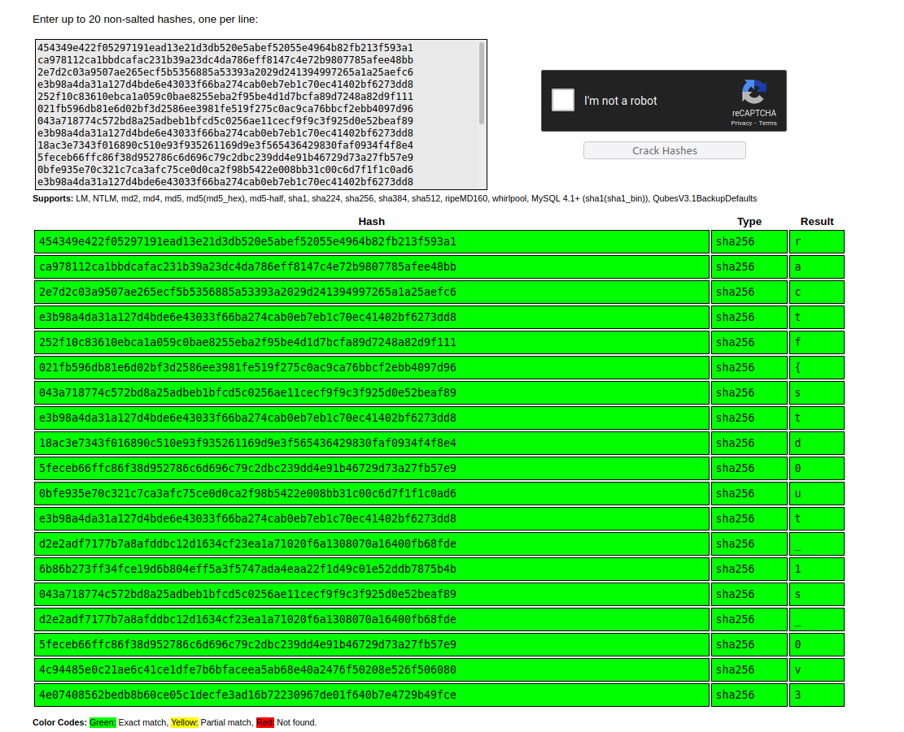
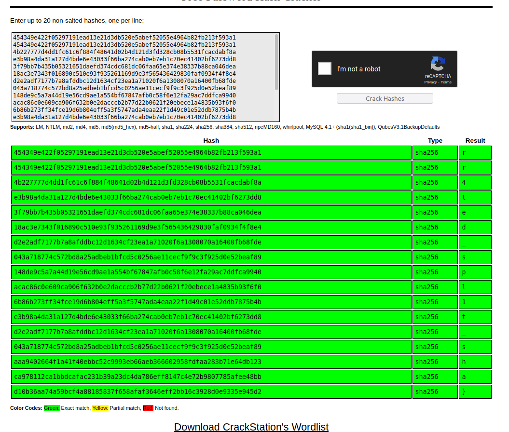

## RACTF - Missing Tools / Misc [ 250 points ] ( 133 solves )
**Description**

> Man, my friend broke his linux install pretty darn bad. He can only use like, 4 commands. Can you take a look and see if you can recover at least some of his data?
> Username: `ractf` 
> Password: `8POlNixzDSThy` 
> Note: it may take a minute or more for your container to start depending on load
## General overview
The challenge gives you an IP where is enabled an ssh port where you can connect to it with the credentials provided in challenge's description. When you connect with ssh it seems, the shell is sandboxed and most of the important commands are either disabled or not installed in the system. 
## Solution
First we connect to the provided IP with ssh:

    ractf@193.57.159.27's password: 
	Linux restricted shell
	$ 
	$ ls
	This command has been disabled by your administrator.
	$ cat /flag.txt
	This command has been disabled by your administrator.
	$ 
Trying simple commands like ls or cat they are seem to be disabled and we can't use them. After trying some other basic linux commands to find out what commands i am allowed to run and which i don't i found `whoami, file, sh, pwd, sleep, echo` i am allowed to run but none of them are useful.

    $ whoami
    ractf
    $ pwd
    /home/ractf
    $ file /home/ractf
    /home/ractf: directory
    $ sleep 2
    $ 
	$ echo "hello"
	hello
	$ echo < /etc/passwd
	$ echo <(/etc/passwd)
	-sh: -sh
	/proc/self/fd/3
	$ echo $(</etc/passwd)
	-sh: -sh

	$ echo $HOME
	/home/ractf
	$ 
I saw that i could read environment variables so i tried to dump some of them

    $ echo $0
    -sh
    $ echo $@
    
    $ echo $SHELL
    /bin/sh
    $ file /bin/sh
    /bin/sh: symbolic link to /opt/toybox
So i found /bin/sh  is pointing to a different shell and not the classic bash.
But before that i wanted to print the environment variables and i thought if it is a shell that is supporting bash style syntax it must support bash's builtins commands so i started to try them all

    $ myvar=5
    $ echo $myvar
    5
    $ eval echo $myvar
    5
    $ eval $((7+7))
    TODO: do math for 7+7 <-- WEIRD???
    eval: ((7+7)): No such file or directory
    $ local
    -sh: local: No such file or directory
    $ printf
    -sh: printf: No such file or directory
    $ dirs
    -sh: dirs: No such file or directory
	$ export
	declare - "=1"
	declare - "=/home/ractf/-sh"
	declare - "=/home/ractf"
	declare - "=/dev/pts/0"
	declare - "=xterm-256color"
	declare - "=ractf"
	declare - "=ractf"
	declare - "=/bin/sh"
	declare - "=/home/ractf"
	declare - "=/usr/bin:/bin"
	$ set
	PS1=\$ 
	SHLVL=1
	_=export
	PWD=/home/ractf
	SSH_TTY=/dev/pts/0
	TERM=xterm-256color
	PS4=+ 
	PS3=#? 
	PS2=> 
	BASH=/opt/toybox
	OPTERR=1
	OSTYPE=Linux
	MACHTYPE=x86_64-unknown-linux
	HOSTTYPE=x86_64
	HOSTNAME=missingtools-2021:missingtools-26a9074a
	LOGNAME=ractf
	USER=ractf
	SHELL=/bin/sh
	HOME=/home/ractf
	PATH=/usr/bin:/bin
	PPID=47
	UID=1000
	EUID=1000
	BASHPID=
	GROUPS=
	LINENO=
	RANDOM=
	SECONDS=
	$ 
	$ variables
	-sh: variables: No such file or directory
	$ unset
	$ alias
	-sh: alias: No such file or directory
	$ type
	-sh: type: No such file or directory
	$ help
	Toybox 0.8.5 multicall binary: https://landley.net/toybox (see toybox --help)

	Toybox 0.8.5 multicall binary: https://landley.net/toybox (see toybox --help)
	$ source /etc/passwd
	source: root:x:0:0:root:/root:: No such file or directory
	source: ractf:x:1000:1000:Linux: No such file or directory
	$ 
Eureka! After trying most of the builtins bash's commands i found that `source` command was supported in this shell.
So basically source command reads a shell script that you give it and tries to execute the shell script line by line.
Abusing source's error functionality we can output the contents of whatever file we want

    $ source /etc/shadow <-- we can read shadow????
    source: root:!::0:::::: No such file or directory
    source: ractf:/IOsSWFp./EdNNxr0z8nnQUNHjptarB/nahv0U1:18834:0:99999:7:::: No such file or directory
    $ source /etc/hostname
    source: missingtools-2021:missingtools-26a9074a: No such file or directory
    $ source /etc/hosts
    source: 127.0.0.1: No such file or directory
    source: ::1: No such file or directory
    source: fe00::0: No such file or directory
    source: ff00::0: No such file or directory
    source: ff02::1: No such file or directory
    source: ff02::2: No such file or directory
    source: 172.17.0.76: No such file or directory
    $ source /flag.txt
    source: /flag.txt: No such file or directory
    $ source flag.txt
    source: ractf{std0ut_1s_0v3rr4ted_spl1t_sha}: No such file or directory
And there is our flag! But this was not the intended solution as the flag suggesting.
After that i started to looking for the intended solution researching about toybox shell, in the previous outputs with `help` command it gives you and the exact url of the project, but before that for some reason i tried to run `/opt/toybox` to my suprise we got some extra info :)

    $ /opt/toybox
    [ bash cal date dirname echo eject false file help lsof mkpasswd pwd sh sha256sum sleep
    split swapoff sync test time toysh true wc whoami yes 
    $ 
Show now we know exacly what commands we are allowed to run and don't. As the flag suggests we have to read the flag with `split` and `sha256sum` 
With the split command you can split the contents of a file into different ones, so you could split a big file to smaller ones for example by 1000 lines, so the point is to split the flag file or any file of our choice to one byte files and calculate the sha256sum of them and recover the their contents. Reading the documentation of split command you can split a file with `split -b 1 flag.txt` and it will split the bytes to `xaa, xab, xac, ...` files by default and then you can calculate their sha256sum like this:
You can easily calculate sha256sum of all the byte files with the help of wildcards:

    $ sha256sum x??
    454349e422f05297191ead13e21d3db520e5abef52055e4964b82fb213f593a1  xaa
    ca978112ca1bbdcafac231b39a23dc4da786eff8147c4e72b9807785afee48bb  xab
    2e7d2c03a9507ae265ecf5b5356885a53393a2029d241394997265a1a25aefc6  xac
    e3b98a4da31a127d4bde6e43033f66ba274cab0eb7eb1c70ec41402bf6273dd8  xad
    252f10c83610ebca1a059c0bae8255eba2f95be4d1d7bcfa89d7248a82d9f111  xae
    021fb596db81e6d02bf3d2586ee3981fe519f275c0ac9ca76bbcf2ebb4097d96  xaf
    043a718774c572bd8a25adbeb1bfcd5c0256ae11cecf9f9c3f925d0e52beaf89  xag
    e3b98a4da31a127d4bde6e43033f66ba274cab0eb7eb1c70ec41402bf6273dd8  xah
    18ac3e7343f016890c510e93f935261169d9e3f565436429830faf0934f4f8e4  xai
    5feceb66ffc86f38d952786c6d696c79c2dbc239dd4e91b46729d73a27fb57e9  xaj
    0bfe935e70c321c7ca3afc75ce0d0ca2f98b5422e008bb31c00c6d7f1f1c0ad6  xak
    e3b98a4da31a127d4bde6e43033f66ba274cab0eb7eb1c70ec41402bf6273dd8  xal
    d2e2adf7177b7a8afddbc12d1634cf23ea1a71020f6a1308070a16400fb68fde  xam
    6b86b273ff34fce19d6b804eff5a3f5747ada4eaa22f1d49c01e52ddb7875b4b  xan
    043a718774c572bd8a25adbeb1bfcd5c0256ae11cecf9f9c3f925d0e52beaf89  xao
    d2e2adf7177b7a8afddbc12d1634cf23ea1a71020f6a1308070a16400fb68fde  xap
    5feceb66ffc86f38d952786c6d696c79c2dbc239dd4e91b46729d73a27fb57e9  xaq
    4c94485e0c21ae6c41ce1dfe7b6bfaceea5ab68e40a2476f50208e526f506080  xar
    4e07408562bedb8b60ce05c1decfe3ad16b72230967de01f640b7e4729b49fce  xas
    454349e422f05297191ead13e21d3db520e5abef52055e4964b82fb213f593a1  xat
    454349e422f05297191ead13e21d3db520e5abef52055e4964b82fb213f593a1  xau
    4b227777d4dd1fc61c6f884f48641d02b4d121d3fd328cb08b5531fcacdabf8a  xav
    e3b98a4da31a127d4bde6e43033f66ba274cab0eb7eb1c70ec41402bf6273dd8  xaw
    3f79bb7b435b05321651daefd374cdc681dc06faa65e374e38337b88ca046dea  xax
    18ac3e7343f016890c510e93f935261169d9e3f565436429830faf0934f4f8e4  xay
    d2e2adf7177b7a8afddbc12d1634cf23ea1a71020f6a1308070a16400fb68fde  xaz
    043a718774c572bd8a25adbeb1bfcd5c0256ae11cecf9f9c3f925d0e52beaf89  xba
    148de9c5a7a44d19e56cd9ae1a554bf67847afb0c58f6e12fa29ac7ddfca9940  xbb
    acac86c0e609ca906f632b0e2dacccb2b77d22b0621f20ebece1a4835b93f6f0  xbc
    6b86b273ff34fce19d6b804eff5a3f5747ada4eaa22f1d49c01e52ddb7875b4b  xbd
    e3b98a4da31a127d4bde6e43033f66ba274cab0eb7eb1c70ec41402bf6273dd8  xbe
    d2e2adf7177b7a8afddbc12d1634cf23ea1a71020f6a1308070a16400fb68fde  xbf
    043a718774c572bd8a25adbeb1bfcd5c0256ae11cecf9f9c3f925d0e52beaf89  xbg
    aaa9402664f1a41f40ebbc52c9993eb66aeb366602958fdfaa283b71e64db123  xbh
    ca978112ca1bbdcafac231b39a23dc4da786eff8147c4e72b9807785afee48bb  xbi
    d10b36aa74a59bcf4a88185837f658afaf3646eff2bb16c3928d0e9335e945d2  xbj
You could write a python/bash script to calculate the flag but i tried crackstation instead because it allows you to crack multiple hashes but max 20 so i had to crack them 20 by 20.

